# Hi, I'm Farhan Madni 

## Current Focus

- Learning and improving my Vue.js skills.
- Building and exploring color-centric projects that inspire creativity.
- Enhancing my UI Dev skills and knowledge.

## Skills

## Featured Projects

Here are a few projects I’ve been working on:

1. **[Awesome](https://github.com/MFM-347/Awesome)** - A curated list of resources, tools, tutorials, repos, and guides.
2. **[Json VisualEdit](https://github.com/MFM-347/Json-VisualEdit)** - A user-friendly JSON visualization and editing tool.
3. **[Expense Tracker](https://github.com/MFM-347/Vue-Expense-Tracker)** - A UI-focused, intuitive expense tracker.

## GitHub Stats

  
  

  
  

> **Note:** Number of commits may include commits from private and deleted repos, so don't get confused by this inconsistency.

## Connect With Me

Feel free to reach out or explore more of my work:

- [Portfolio](https://xyzdev.vercel.app)
- [CodePen](https://codepen.io/MFM-347)
- [Facebook](https://www.facebook.com/mfm347)
- [YouTube](https://www.youtube.com/@T4C-347)
- [DevTo](https://dev.to/mfm347)
- [Twitter](https://twitter.com/@mfm347)
- [Email](mailto:madnifm347@outlook.com)

